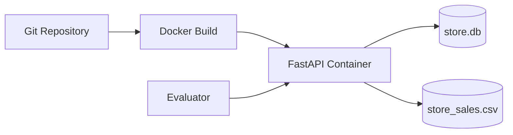
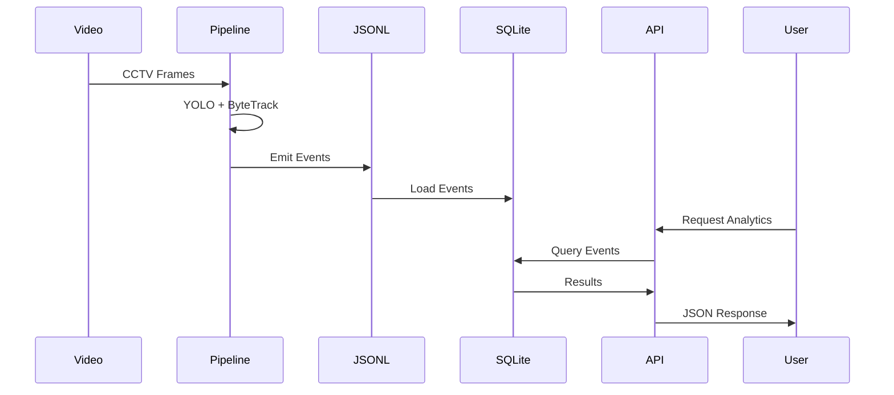

# Store Intelligence — System Design

## Problem Statement

Retail stores generate large amounts of behavioral data through CCTV cameras. This data contains valuable insights about customer movement, zone engagement, dwell time, and purchase intent, but remains locked inside raw video footage and is rarely transformed into actionable business intelligence.

The objective of this project is to build an end-to-end Store Intelligence Platform that converts CCTV footage into structured retail events and exposes analytics through a REST API.

### Goals

- Detect and track visitors from CCTV footage
- Generate structured behavioral events
- Store and query analytics efficiently
- Expose store intelligence through APIs
- Support rapid evaluator testing through Docker deployment

### Constraints

- Evaluation should complete within 5 minutes
- Docker startup should be fast and reliable
- Solution should work on consumer hardware
- API should run independently of heavy ML dependencies

---

# High Level Architecture

flowchart TB

    subgraph offline["Offline Processing Pipeline"]
        V[CCTV Videos]
        Y[YOLOv8n Detection]
        B[ByteTrack Tracking]
        E[Event Generator]
        J[events.jsonl]

        V --> Y
        Y --> B
        B --> E
        E --> J
    end

    subgraph storage["Storage Layer"]
        D[(SQLite store.db)]
        S[(Sales CSV)]

        J --> D
    end

    subgraph online["Online Analytics API"]
        F[FastAPI]

        D --> F
        S --> F

        F --> M[/metrics]
        F --> H[/heatmap]
        F --> A[/anomalies]
        F --> FU[/funnel]
        F --> SA[/sales]
        F --> I[/events/ingest]
    end
```

The architecture deliberately separates computer vision processing from API serving.

Heavy ML workloads execute offline and generate structured events. The online API layer consumes pre-generated events and serves analytics instantly. This design ensures Docker startup remains fast and evaluator-friendly.

---

# Detection Pipeline

## Input

The pipeline consumes CCTV videos stored under:

```text
data/videos/
```

Videos are processed camera by camera and converted into visitor events.

---

## Detection Model

### YOLOv8n

The project uses YOLOv8 Nano (`yolov8n.pt`) from Ultralytics.

Reasons for selecting YOLOv8n:

- Lightweight (~6 MB model)
- Fast CPU inference
- Excellent developer ecosystem
- Native tracking integration
- Suitable for evaluation hardware constraints

Only the COCO "person" class is processed.

---

## Performance Optimizations

| Parameter | Value | Purpose |
|------------|---------|----------|
| FRAME_SKIP | 10 | Process every 10th frame |
| MAX_FRAMES_PER_VIDEO | 1500 | Bound processing time |
| PIPELINE_MAX_SECONDS | 300 | Hard 5-minute limit |

These constraints ensure the full pipeline remains practical on CPU-only systems.

---

## Detection Output

Each processed frame generates:

- Person bounding boxes
- Confidence scores
- Tracking inputs for ByteTrack

These detections are forwarded to the tracking layer.

---

# Tracking Pipeline

## ByteTrack

Tracking is implemented using ByteTrack through Ultralytics:

```python
model.track(
    persist=True,
    tracker="bytetrack.yaml"
)
```

ByteTrack was selected because it:

- Maintains stable identities
- Handles brief occlusions
- Requires minimal configuration
- Integrates directly with YOLOv8

---

## State Tracking

```text
first_seen_frame
emitted_visitors
```

### first_seen_frame

Stores the frame where a visitor was first observed.

### emitted_visitors

Tracks visitors who have already produced an event.

This prevents duplicate analytics inflation.

---

## Dwell Logic

```python
dwell_seconds =
(current_frame - first_seen_frame) / fps

if dwell_seconds >= 10:
    emit_event()
```

A visitor generates at most one dwell event during a processing run.

---

# Event Schema Design

Events are stored in JSONL format.

Each line contains one event record.

## Example Event

```json
{
  "event_id": "EVT_101_250",
  "visitor_id": "VIS_101",
  "camera_id": "CAM_1",
  "event_type": "ZONE_DWELL",
  "timestamp": "2026-05-31T10:15:20Z",
  "zone_id": "SKINCARE",
  "dwell_seconds": 10.01,
  "is_staff": false,
  "confidence": 0.90,
  "metadata": {
    "session_seq": 1
  }
}
```

---

## Schema Rationale

### JSONL

JSON Lines was selected because:

- Append-only writes are efficient
- Easy to debug manually
- Scales well for event streams
- Simple ingestion into databases

### Unique Event IDs

Each event receives a unique identifier:

```text
EVT_{track_id}_{frame_number}
```

This enables idempotent ingestion.

### Flat Structure

A flat schema simplifies:

- Database storage
- API serialization
- Analytics queries

---

# Database Design

## Engine

SQLite is used through SQLAlchemy ORM.

Database file:

```text
store.db
```

---

## Events Table

| Column | Description |
|----------|-------------|
| id | Primary key |
| event_id | Unique event identifier |
| store_id | Store identifier |
| visitor_id | Visitor identifier |
| camera_id | Camera source |
| event_type | Event classification |
| timestamp | Event timestamp |
| zone_id | Store zone |
| dwell_seconds | Time spent in zone |
| is_staff | Staff flag |
| confidence | Detection confidence |

---

## Loading Strategy

The ingestion pipeline:

1. Reads events.jsonl
2. Validates records
3. Checks duplicates
4. Inserts into SQLite
5. Commits in batches

Duplicate event IDs are skipped automatically.

---

## Sales Data

Sales data is stored separately as:

```text
data/sales/store_sales.csv
```

The sales endpoint loads this file directly using Pandas.

---

# API Design

## Framework

The API uses:

- FastAPI
- Pydantic v2
- SQLAlchemy
- Uvicorn

Benefits:

- Automatic validation
- OpenAPI generation
- Interactive Swagger UI
- Strong typing

---

# Endpoint Overview

| Endpoint | Purpose |
|-----------|----------|
| GET /health | Service health |
| POST /events/ingest | Event ingestion |
| GET /stores/{id}/metrics | Visitor analytics |
| GET /stores/{id}/heatmap | Zone engagement |
| GET /stores/{id}/anomalies | Anomaly detection |
| GET /stores/{id}/funnel | Conversion funnel |
| GET /stores/{id}/sales | Sales analytics |

---

# Funnel Logic

The funnel measures conversion progression.

```text
Visitors
    ↓
Engaged Visitors
    ↓
Billing Visitors
    ↓
Converted Customers
```

Metrics include:

- Visitor count
- Engagement count
- Billing count
- Conversion rate

---

# Error Handling

Implemented safeguards include:

- Duplicate event protection
- Empty dataset handling
- Missing store handling
- Graceful API responses

Example:

```json
{
  "status": "duplicate_event"
}
```

---

# Deployment Architecture



The container intentionally excludes:

- YOLO
- Torch
- OpenCV
- Raw CCTV videos

This significantly reduces image size and startup time.

---

# Docker Design

## Included

- FastAPI application
- SQLite database
- Sales CSV
- Event dataset

## Excluded

- YOLO model weights
- OpenCV
- Torch
- Raw CCTV videos
- Pipeline dependencies

This separation allows:

- Faster builds
- Faster startup
- Easier evaluation

---

# Data Flow



---

# AI-Assisted Decisions

AI tools including ChatGPT, Cursor, and GitHub Copilot were used throughout development.

## Detection Model Selection

AI suggested multiple approaches including:

- YOLOv8
- Faster R-CNN
- MediaPipe

YOLOv8n was selected because it offered the best balance between speed, accuracy, and simplicity under hackathon constraints.

---

## Deployment Strategy

AI initially suggested packaging the entire ML pipeline inside Docker.

This approach was rejected because:

- Large image size
- Slow startup
- Additional dependency complexity

Instead, the final design separates:

- Offline inference pipeline
- Online analytics API

This improved evaluator experience significantly.

---

## Database Choice

AI suggested both PostgreSQL and SQLite.

SQLite was selected because:

- Zero infrastructure requirements
- Simple deployment
- Single-file portability
- Sufficient scale for evaluation

The architecture remains compatible with future PostgreSQL migration.

---

# Scalability Considerations

## Current MVP

| Component | Limitation |
|------------|-------------|
| SQLite | Single writer |
| FastAPI | Single process |
| Pipeline | Sequential processing |

---

## Production Evolution

Potential upgrades include:

| Area | Future Upgrade |
|--------|---------------|
| Database | PostgreSQL |
| Event Streaming | Kafka |
| Inference | GPU acceleration |
| Analytics | Redis caching |
| Deployment | Kubernetes |
| Authentication | OAuth2 / JWT |
| Monitoring | Prometheus + Grafana |

---

# Store Layout Intelligence

The challenge provided physical store layouts containing shelf and brand locations.

Future versions can map tracked visitor coordinates to:

- Individual brands
- Product shelves
- Store sections

This would enable:

- Brand-level heatmaps
- Shelf engagement analytics
- Layout optimization recommendations
- Product discovery analysis

---

# Conclusion

This system demonstrates an end-to-end retail intelligence workflow that transforms CCTV footage into actionable analytics.

The architecture prioritizes:

- Simplicity
- Fast evaluation
- Deployment reliability
- Extensibility

while maintaining a clear path toward production-scale retail analytics.
