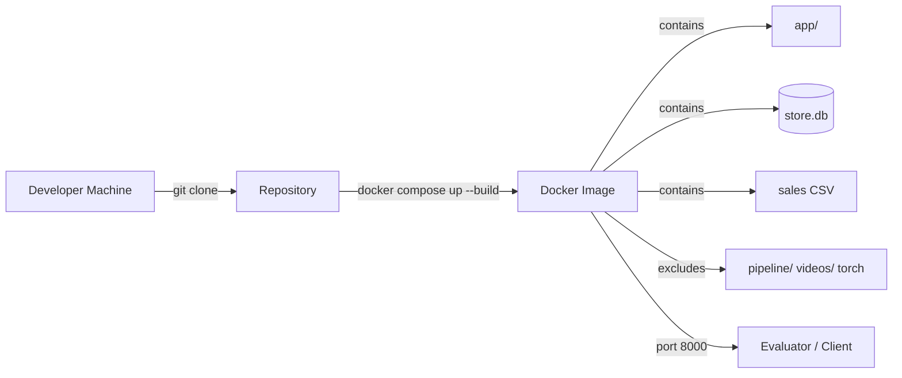
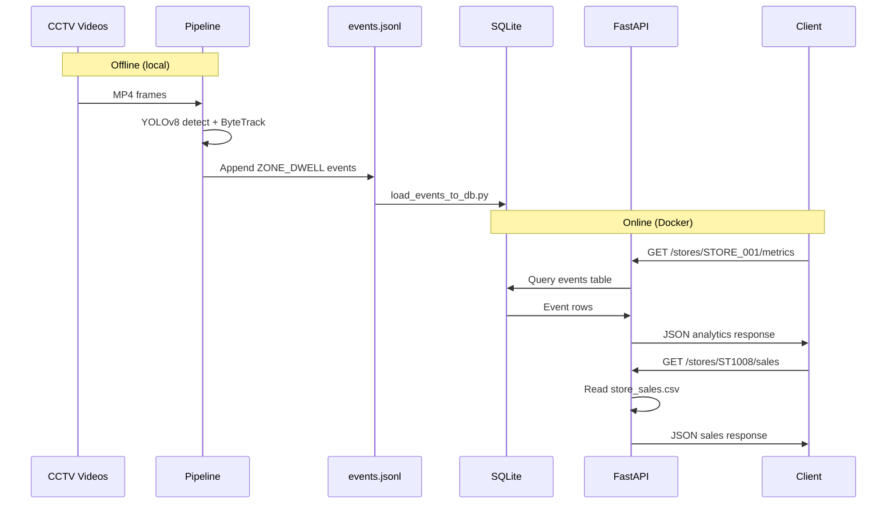

# Store Intelligence — System Design

## Problem Statement

Retail stores operate multiple CCTV cameras that capture rich behavioral data — foot traffic, zone engagement, dwell patterns, and conversion signals. However, this data remains locked in raw video format and is not actionable for store managers or data teams.

**Goal:** Build a system that converts multi-camera CCTV footage into structured visitor events and exposes store-level analytics through a REST API, enabling data-driven retail decisions.

**Constraints:**
- Hackathon evaluation must complete in under 5 minutes
- Docker deployment must start instantly without ML dependencies
- Pipeline must run on consumer hardware (CPU-only feasible)

---

## High Level Architecture

```mermaid
flowchart TB
    subgraph offline ["Offline Pipeline (Local)"]
        V[CCTV Videos<br/>CAM1 CAM2 CAM3]
        Y[YOLOv8n Detection]
        B[ByteTrack Tracking]
        E[Event Generator]
        J[events.jsonl]
        L[load_events_to_db.py]
        V --> Y --> B --> E --> J --> L
    end

    subgraph storage ["Storage Layer"]
        DB[(SQLite store.db)]
        CSV[sales CSV]
        J --> DB
    end

    subgraph online ["Online API (Docker)"]
        F[FastAPI + Uvicorn]
        DB --> F
        CSV --> F
        F --> A1[/metrics]
        F --> A2[/heatmap]
        F --> A3[/anomalies]
        F --> A4[/funnel]
        F --> A5[/sales]
        F --> A6[/events/ingest]
    end
```

The architecture deliberately separates **compute-heavy CV processing** (offline, local) from **lightweight API serving** (online, Docker). This mirrors production patterns where inference runs on edge/GPU nodes and APIs run on standard cloud containers.

---

## Detection Pipeline

### Input
- MP4 video files from `data/videos/`
- Cameras: CAM1, CAM2, CAM3 (CAM4 and CAM5 skipped for performance)

### Model
- **YOLOv8n** (nano) — smallest YOLOv8 variant
- COCO class filter: `[0]` (person only)
- Model weights: `yolov8n.pt` (auto-downloaded by Ultralytics if absent)

### Performance Optimizations

| Parameter | Value | Rationale |
|---|---|---|
| `FRAME_SKIP` | 10 | Process every 10th frame; 10× speedup |
| `MAX_FRAMES_PER_VIDEO` | 1000 | Cap per-video processing time |
| `PIPELINE_MAX_SECONDS` | 300 | Hard 5-minute deadline |

### Output
- Bounding boxes per detected person per processed frame
- Passed to ByteTrack for identity assignment

---

## Tracking Pipeline

### Tracker
- **ByteTrack** via Ultralytics `model.track(persist=True, tracker="bytetrack.yaml")`
- Maintains track IDs across frames within and across videos

### State Management

```
first_seen_frame:  { track_id → first_frame_number }
emitted_visitors:  set of track_ids with emitted events
```

### Dwell Logic

```
dwell_seconds = (current_frame - first_seen_frame[track_id]) / fps

if dwell_seconds >= 10 and track_id not in emitted_visitors:
    emit ZONE_DWELL event
    add track_id to emitted_visitors
```

Each visitor generates **at most one** dwell event per pipeline run, preventing duplicate analytics inflation.

---

## Event Schema Design

Events are stored as JSON Lines (JSONL) — one JSON object per line.

### JSONL Record

```json
{
  "event_id": "EVT_{track_id}_{frame_number}",
  "visitor_id": "VIS_{track_id}",
  "camera_id": "CAM 1",
  "event_type": "ZONE_DWELL",
  "timestamp": "2026-05-30T18:02:40.679718",
  "zone_id": "SKINCARE",
  "dwell_seconds": 10.01,
  "is_staff": false,
  "confidence": 0.90,
  "metadata": { "session_seq": 1 }
}
```

### Field Definitions

| Field | Type | Description |
|---|---|---|
| `event_id` | string | Unique event identifier |
| `visitor_id` | string | Tracker-assigned visitor ID |
| `camera_id` | string | Source CCTV camera |
| `event_type` | string | Event classification (`ZONE_DWELL`) |
| `timestamp` | ISO 8601 string | Event generation time (UTC) |
| `zone_id` | string | Store zone label |
| `dwell_seconds` | float | Time spent in zone |
| `is_staff` | boolean | Staff flag (future use) |
| `confidence` | float | Detection confidence score |
| `metadata` | object | Extensible key-value metadata |

### Design Rationale
- **JSONL** enables append-only writes during long video processing
- **Flat schema** simplifies SQLite mapping and API serialization
- **event_id uniqueness** enables idempotent ingestion

---

## Database Design

### Engine
SQLite (`store.db`) via SQLAlchemy ORM

### Table: `events`

| Column | Type | Constraints |
|---|---|---|
| `id` | INTEGER | PRIMARY KEY, auto-increment |
| `event_id` | VARCHAR | UNIQUE, indexed |
| `store_id` | VARCHAR | indexed |
| `visitor_id` | VARCHAR | indexed |
| `camera_id` | VARCHAR | |
| `event_type` | VARCHAR | |
| `timestamp` | VARCHAR | ISO 8601 |
| `zone_id` | VARCHAR | |
| `dwell_seconds` | FLOAT | |
| `is_staff` | BOOLEAN | |
| `confidence` | FLOAT | |

### Loading Strategy
1. `load_events_to_db.py` reads `events.jsonl` line-by-line
2. Skips duplicates by `event_id` (idempotent reload)
3. Defaults `store_id` to `STORE_001` if absent in JSONL
4. Batch commits every 500 rows

### Sales Data
- Static CSV at `data/sales/store_sales.csv`
- Read directly by Pandas in the sales endpoint (not stored in SQLite)

---

## API Design

### Framework
FastAPI with Pydantic v2 validation and automatic OpenAPI documentation.

### Endpoint Summary

| Endpoint | Data Source | Logic |
|---|---|---|
| `GET /health` | — | Liveness probe |
| `POST /events/ingest` | SQLite | Insert with duplicate check |
| `GET /stores/{id}/metrics` | SQLite | Unique visitors, avg dwell, staff count |
| `GET /stores/{id}/heatmap` | SQLite | Zone event frequency aggregation |
| `GET /stores/{id}/anomalies` | SQLite | Events with dwell > 25 seconds |
| `GET /stores/{id}/funnel` | SQLite | Visitor → engaged (≥10s) → billing |
| `GET /stores/{id}/sales` | CSV | Revenue, AOV, top products |

### Funnel Stages

```
visitors     = unique non-staff visitor_ids
engaged      = visitors with dwell_seconds >= 10
billing      = visitors at CAM 5 or zone BILLING
conversion   = (billing / visitors) × 100
```

### Error Handling
- Duplicate ingestion returns `{"status": "duplicate_event"}` (HTTP 200)
- Missing sales store returns empty aggregates (zero transactions)

---

## Deployment Architecture



### Docker Image Contents

| Included | Excluded |
|---|---|
| `app/` | `pipeline/` |
| `store.db` | `data/videos/` |
| `data/sales/` | `requirements-pipeline.txt` |
| `data/events/` | YOLO weights, torch, opencv |
| `requirements-api.txt` | `run_pipeline.py` |

### Container Startup
```
python:3.9-slim
  → pip install requirements-api.txt
  → COPY app/, data/, store.db
  → CMD uvicorn app.main:app --host 0.0.0.0 --port 8000
```

---

## Data Flow



---

## Scalability Considerations

### Current (Hackathon / MVP)

| Component | Scale Limit |
|---|---|
| SQLite | Single writer, ~100K events |
| FastAPI | Single process, moderate concurrency |
| Pipeline | Sequential video processing, CPU-bound |

### Production Path

| Component | Upgrade |
|---|---|
| Event storage | PostgreSQL or TimescaleDB |
| Event bus | Apache Kafka / Redis Streams |
| Inference | GPU nodes with TensorRT-optimized YOLO |
| API | Horizontal scaling behind load balancer |
| Tracking | Dedicated multi-camera Re-ID pipeline |
| Sales | Real-time POS API integration |
| Auth | OAuth2 / API keys per store tenant |

### Observability (Future)
- Structured logging (JSON logs)
- Prometheus metrics on API latency and event throughput
- Health checks with DB connectivity validation
