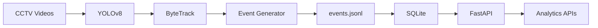

# Store Intelligence System

**Purplle Tech Challenge — Computer Vision + Analytics Platform**

A production-oriented store analytics system that converts multi-camera CCTV footage into structured visitor events and serves real-time retail intelligence through a FastAPI analytics layer.

---

## Project Overview

Retail stores generate rich behavioral signals through CCTV footage — foot traffic, zone engagement, dwell time, and conversion patterns. This project implements an end-to-end pipeline that:

1. Detects people in store camera feeds using **YOLOv8**
2. Tracks visitors across frames using **ByteTrack**
3. Generates structured **ZONE_DWELL** events
4. Persists events to **JSONL** and **SQLite**
5. Exposes analytics through a **FastAPI** REST API
6. Ships as a lightweight **Docker** container for instant evaluation

The system separates **offline ML processing** (local pipeline) from **online API serving** (Docker), enabling fast hackathon evaluation while preserving a realistic production architecture.

---

## Features

| Layer | Capability |
|---|---|
| **Computer Vision** | YOLOv8n person detection (COCO class 0) |
| **Tracking** | ByteTrack multi-object tracking via Ultralytics |
| **Multi-Camera** | Processes CAM1, CAM2, CAM3 CCTV feeds |
| **Event Generation** | ZONE_DWELL events after configurable dwell threshold |
| **Storage** | Append-only JSONL + SQLite relational store |
| **Analytics API** | Metrics, heatmap, anomalies, funnel, sales |
| **Deployment** | Docker Compose — API-only container, pre-loaded database |
| **Ingestion** | POST endpoint for live event ingestion |

---

## Architecture Overview



### Two-Stage Workflow

| Stage | Command | Purpose |
|---|---|---|
| **Local Pipeline** | `python run_pipeline.py` | Generate events from videos, load into SQLite |
| **Docker API** | `docker compose up --build` | Serve analytics from pre-generated `store.db` |

Docker intentionally **does not** run YOLO, OpenCV, or event generation. The image contains only the FastAPI service and pre-built data artifacts.

---

## Folder Structure

```
store-intelligence/
├── app/                        # FastAPI application
│   ├── main.py                 # API routes
│   ├── database.py             # SQLite connection
│   ├── models.py               # SQLAlchemy ORM models
│   ├── schemas.py              # Pydantic request/response schemas
│   └── init_db.py              # Database initialization
├── pipeline/                   # Offline ML pipeline (local only)
│   ├── event_generator.py      # YOLOv8 + ByteTrack event generation
│   └── load_events_to_db.py    # JSONL → SQLite loader
├── data/
│   ├── videos/                 # CCTV footage (not committed)
│   ├── events/
│   │   └── events.jsonl        # Generated visitor events
│   └── sales/
│       └── store_sales.csv     # POS sales data
├── docs/                       # Supplementary documentation
├── run_pipeline.py             # Pipeline orchestrator
├── store.db                    # Pre-generated SQLite database
├── Dockerfile                  # API-only container
├── docker-compose.yml          # Single-service deployment
├── requirements-api.txt        # FastAPI dependencies
├── requirements-pipeline.txt   # ML pipeline dependencies
├── README.md
├── DESIGN.md
├── CHOICES.md
└── SUBMISSION_CHECKLIST.md
```

---

## Installation

### Prerequisites

- Python 3.9+
- Docker Desktop (for API deployment)
- Git

### Clone the Repository

```bash
git clone <repository-url>
cd store-intelligence
```

### API Dependencies (required for Docker and local API)

```bash
python -m venv .venv
source .venv/bin/activate        # Windows: .venv\Scripts\activate
pip install -r requirements-api.txt
```

### Pipeline Dependencies (optional — for regenerating events from videos)

```bash
pip install -r requirements-pipeline.txt
```

Place CCTV videos in `data/videos/` named `CAM1.mp4`, `CAM2.mp4`, `CAM3.mp4` (or `CAM 1.mp4`, etc.).

---

## Running Locally

### Option A — Evaluate APIs Only (fastest)

A pre-generated `store.db` and `data/events/events.jsonl` are included in the repository.

```bash
uvicorn app.main:app --reload --host 0.0.0.0 --port 8000
```

Open [http://localhost:8000/docs](http://localhost:8000/docs) for interactive Swagger UI.

### Option B — Regenerate Events from Videos

```bash
python run_pipeline.py
```

This will:
1. Skip event generation if `data/events/events.jsonl` already exists
2. Otherwise run YOLOv8 + ByteTrack on CAM1–CAM3 videos
3. Load events into `store.db`

Then start the API:

```bash
uvicorn app.main:app --reload --host 0.0.0.0 --port 8000
```

---

## Docker Setup

**Requires Docker Desktop to be running.**

```bash
docker compose up --build
```

The container:
- Installs only `requirements-api.txt` (FastAPI, SQLAlchemy, Pandas, Pydantic)
- Copies `app/`, `store.db`, `data/sales/`, and `data/events/`
- Starts Uvicorn on port **8000**

Verify:

```bash
curl http://localhost:8000/health
```

Expected response:

```json
{"status": "healthy"}
```

---

## API Documentation

Base URL: `http://localhost:8000`

| Method | Endpoint | Description |
|---|---|---|
| `GET` | `/health` | Service health check |
| `POST` | `/events/ingest` | Ingest a single visitor event |
| `GET` | `/stores/{store_id}/metrics` | Unique visitors, avg dwell, staff count |
| `GET` | `/stores/{store_id}/heatmap` | Zone-level event frequency |
| `GET` | `/stores/{store_id}/anomalies` | Long dwell time anomalies (> 25s) |
| `GET` | `/stores/{store_id}/funnel` | Visitor → engaged → billing conversion |
| `GET` | `/stores/{store_id}/sales` | Revenue, transactions, top products |

### Example Requests

```bash
# Health
curl http://localhost:8000/health

# Store metrics
curl http://localhost:8000/stores/STORE_001/metrics

# Heatmap
curl http://localhost:8000/stores/STORE_001/heatmap

# Anomalies
curl http://localhost:8000/stores/STORE_001/anomalies

# Conversion funnel
curl http://localhost:8000/stores/STORE_001/funnel

# Sales analytics
curl http://localhost:8000/stores/ST1008/sales
```

### Event Ingestion Payload

```json
{
  "event_id": "EVT_100_500",
  "store_id": "STORE_001",
  "visitor_id": "VIS_100",
  "camera_id": "CAM 1",
  "event_type": "ZONE_DWELL",
  "timestamp": "2026-05-30T12:00:00",
  "zone_id": "SKINCARE",
  "dwell_seconds": 12.5,
  "is_staff": false,
  "confidence": 0.90
}
```

### Sample Responses

**Metrics** (`GET /stores/STORE_001/metrics`):

```json
{
  "store_id": "STORE_001",
  "unique_visitors": 61,
  "average_dwell_time": 10.11,
  "staff_count": 0,
  "total_events": 63
}
```

**Sales** (`GET /stores/ST1008/sales`):

```json
{
  "store_id": "ST1008",
  "transactions": 24,
  "revenue": 34331.71,
  "average_order_value": 1430.49,
  "top_products": ["Good Vibes Brightening Sheet Mask - Rice (20 ml)", "..."]
}
```

Interactive documentation: [http://localhost:8000/docs](http://localhost:8000/docs)

---

## Testing

Use the project virtual environment (recommended). From the project root:

**Windows (PowerShell):**

```powershell
python -m venv .venv
.\.venv\Scripts\Activate.ps1
pip install -r requirements-dev.txt
pytest
```

**macOS / Linux:**

```bash
python -m venv .venv
source .venv/bin/activate
pip install -r requirements-dev.txt
pytest
```

Expected output:

```
4 passed
```

Tests cover health, metrics, funnel, and sales endpoints using FastAPI's `TestClient`.

**Troubleshooting:** If `pip install` fails building `greenlet` with a MSVC error, you are likely using system Python without a compiler. Activate `.venv` and retry — `requirements-dev.txt` pins a prebuilt `greenlet` wheel for Windows. If `ModuleNotFoundError: No module named 'fastapi'`, the install did not finish; fix the install before running `pytest`.

---

## Logging

API requests and ingestion events are logged using Python's standard `logging` module.

- Logger name: `store-intelligence`
- Level: `INFO`
- Format: `%(asctime)s - %(levelname)s - %(message)s`

Logged events include API startup, health checks, store analytics requests, and event ingestion. Logs are written to stdout and are visible when running Uvicorn locally or via `docker compose logs`.

Configuration: `app/logger.py`

---

## Assumptions

- CCTV videos cover store zones mapped to logical zone IDs (e.g., `SKINCARE`)
- Person detection uses COCO class 0 (person) only
- Dwell events are emitted once per visitor after **10 seconds** in a zone
- Default store ID for pipeline-generated events is `STORE_001`
- Sales data is provided as a static CSV (`data/sales/store_sales.csv`)
- Billing zone detection uses `CAM 5` or zone ID `BILLING`
- Evaluators have Docker Desktop installed and running

---

## Limitations

- Zone mapping is camera-level, not pixel-polygon based
- No real-time streaming; pipeline processes recorded MP4 files
- Staff detection is not implemented (`is_staff` defaults to `false`)
- Funnel billing stage relies on camera/zone heuristics, not POS integration
- SQLite is single-writer; not suited for high-concurrency production loads
- Pipeline processes CAM1–CAM3 only; CAM4 and CAM5 are skipped for performance
- Frame skip (`FRAME_SKIP=10`) trades temporal precision for speed

---

## Future Improvements

- Polygon-based zone mapping per camera view
- Real-time RTSP stream ingestion
- Staff vs. customer classification model
- PostgreSQL / TimescaleDB for production scale
- Kafka event bus for decoupled ingestion
- Grafana dashboards for store ops teams
- GPU-accelerated inference pipeline
- Multi-store tenant isolation and auth

---

## Documentation Index

| Document | Description |
|---|---|
| [DESIGN.md](./DESIGN.md) | System design, schemas, data flow |
| [CHOICES.md](./CHOICES.md) | Technology decisions and tradeoffs |
| [SUBMISSION_CHECKLIST.md](./SUBMISSION_CHECKLIST.md) | Pre-submission verification |

---

## License

Built for the Purplle Tech Challenge hackathon submission.
