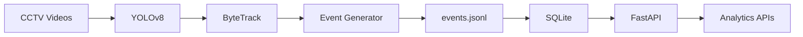
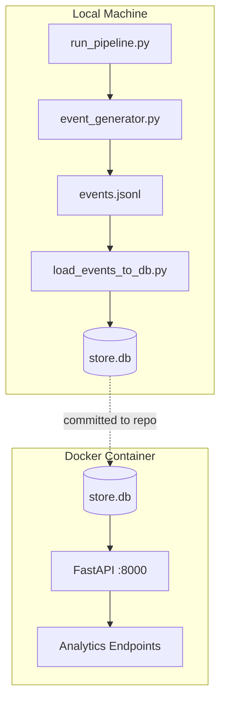

# Architecture Diagram

Standalone reference for the Store Intelligence data pipeline.

## Stage Descriptions

| Stage | Component | Technology |
|---|---|---|
| Input | CCTV Videos | MP4 files (CAM1, CAM2, CAM3) |
| Detection | YOLOv8 | YOLOv8n person detection |
| Tracking | ByteTrack | Multi-object identity tracking |
| Events | Event Generator | ZONE_DWELL event creation |
| Storage | events.jsonl | Append-only JSON Lines file |
| Database | SQLite | Relational event store (`store.db`) |
| API | FastAPI | REST analytics service |
| Output | Analytics APIs | Metrics, heatmap, funnel, sales |

## Deployment Split

The offline pipeline runs locally. Docker serves the pre-built database through FastAPI only.
